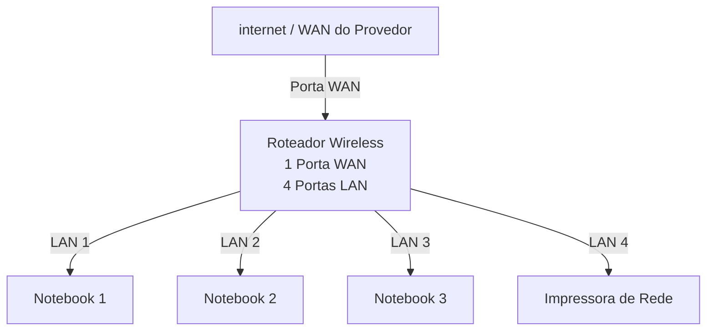
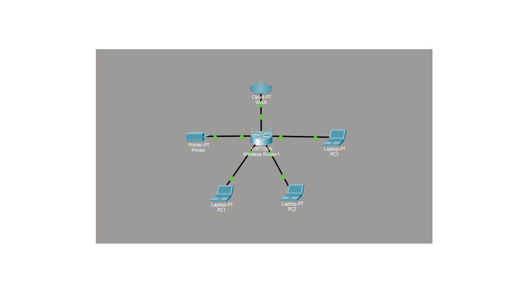

# Laboratório De Redes 01 - Projeto De Rede Local
Projeto desenvolvido na diciplina de rede de computadores no curso tecnico de informatica do SENAC

 - Aluno: Ruan Anderson

 - Professor: José de Assis

 - Data: 09/03/2026

---

## 1. Objetivo
Implementar uma Rede local simples conectando 3 nootebooks a um roteador wirelees com switch
intetegrado e uma impressora de rede.

O projeto será realizado em duas etapas:

1. Simulação de rede no Cisco Packet Tracer
2. Implementar de rede no laboratório real

---

## 2. Equipamento Utilizado Neste Laboratório

- 3 Notebooks
- 1 Roteador
- 1 Impressora
- cabo de rede

---

## 3. Topologia Da Rede
Diagrama lógico da rede utilizada neste laboratorio:

Imagem da Topologia utilizada no laboratório:

---

## 4. Plano de endereçamento IP

Rede: 192.168.0.0/24

Gateway: 192.168.0.1

| Dispositivo | Tipo de IP | Endereço IP | Observação |
|-------------|-------------|-------------|-------------|
| Roteador | Estático | 192.168.0.1 | IP do Roteador |
| Impressora | Reserva DHCP | 192.168.0.105 | IP Pelo Roteador |
| PC1 | Reserva DHCP | 192.168.0.102 | IP reservado Pelo Roteador |
| PC2 | DHCP | Automático | IP Atribuido Pelo Roteador |

**Observação**
 - A impressora e um dos notebooks utilizam reserva DHCP.
 - O roteador sempre atribui o mesmo endereço IP a esse dispositivo.

---

## 5. Implementação no Laboratorio Real

Após a instalação, a rede foi montada fisicamente no laboratório.

Etapas Reaalizadas:

(fotos - Capturas de tela realizadas durante o laboratório)

Teste:

(fotos - Capturas de tela realizadas durante o laboratório)

---

## 6. Conclusão 

Este Laboratório permitiu compreender o funcionamento de uma rede local simples, incluindo:

- Estrutura de uma rede doméstica ou de pequeno escritório
- Utilização de um roteador com portam WAN e portas LAN
- Funcionamento do DHCP
- Comunicação entre dispositivos na rede local
- Utilização de uma impressora de rede
- Compartilhamento de pastas na rede
